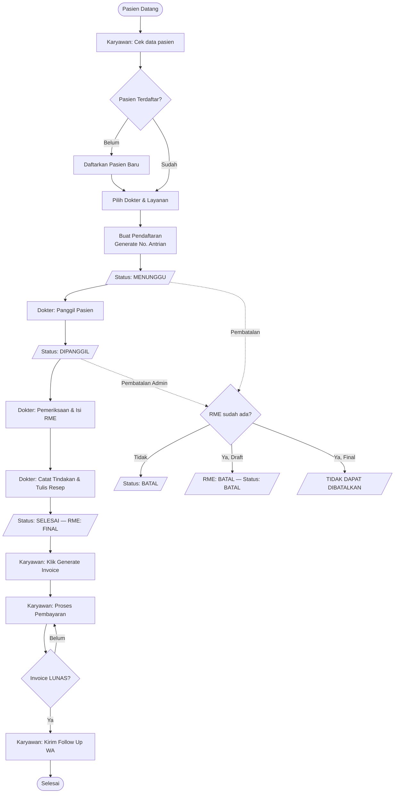
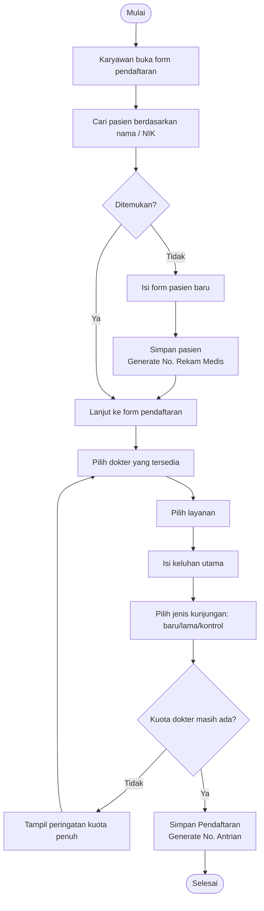
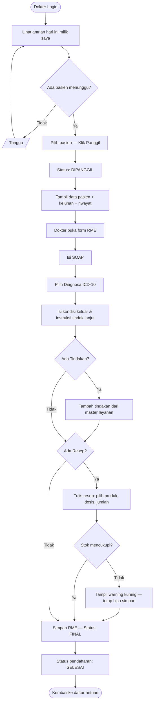
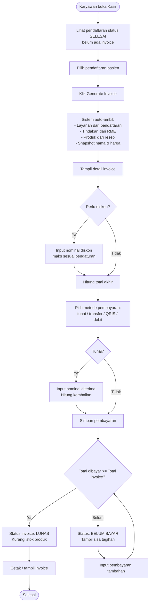
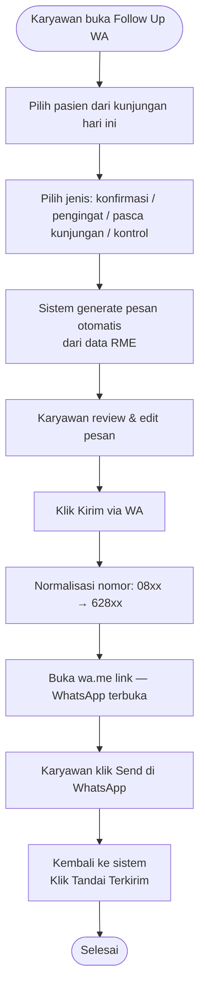
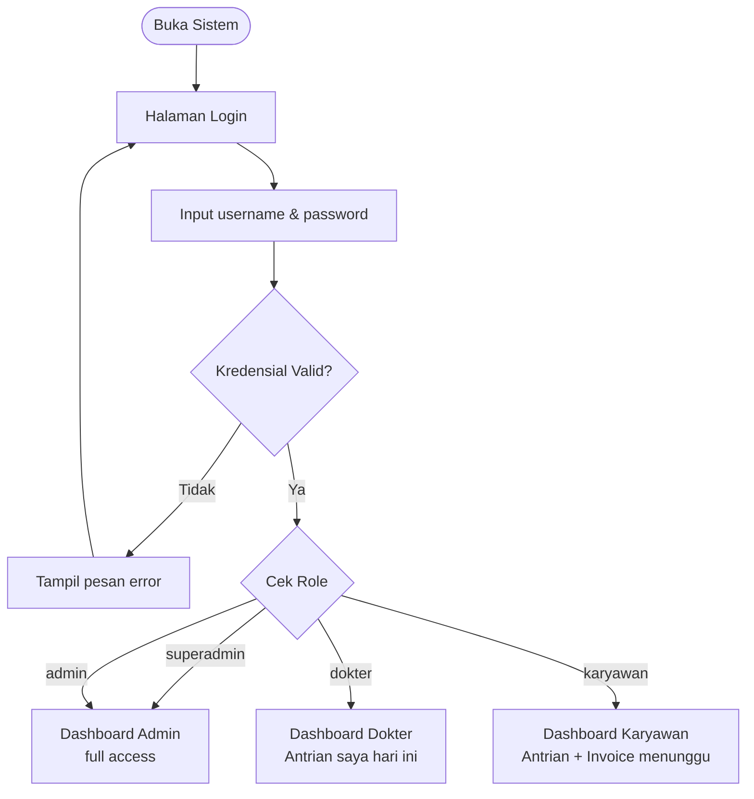
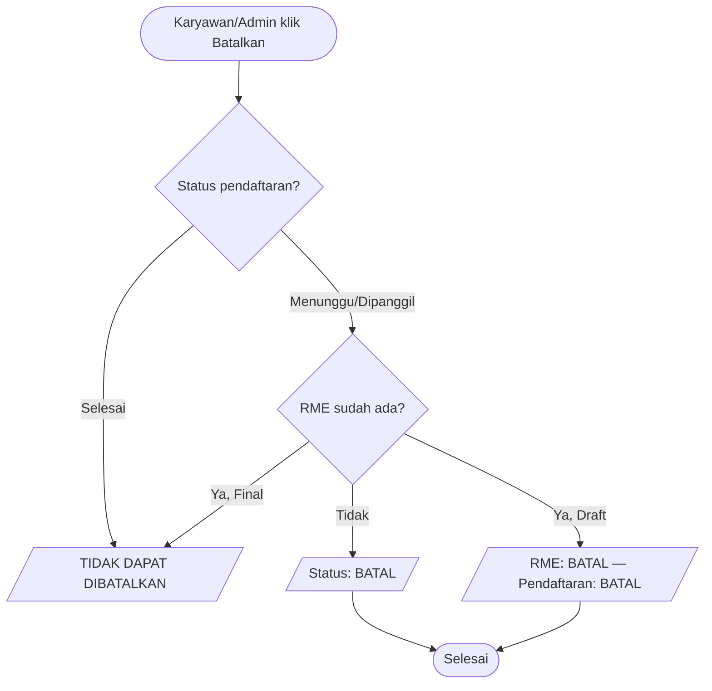

# SIMKlinik — Master Planning Document
> Klinik Kecantikan + Dokter Umum | Stack: Next.js (Vercel) + PHP Bridge + MySQL (cPanel)
> Versi: 1.0 | Status: Final for Agent Use

---

## 1. Arsitektur Sistem

```
Browser
  ↓
Vercel (Next.js)
  ├── Pages & Components (React + Tailwind)
  ├── API Routes (/api/**) ← semua business logic
  └── Auth (NextAuth — credentials provider, JWT)
       ↓
  cPanel PHP Bridge (satu file, localhost MySQL)
       ↓
  MySQL (cPanel shared hosting)
```

### Prinsip Arsitektur

- **Vercel** = frontend, semua API routes, auth, business logic, PDF generation
- **cPanel PHP bridge** = satu file PHP yang menerima request dari Vercel, menjalankan query ke MySQL via localhost, mengembalikan JSON
- **Database tidak pernah terekspos langsung ke publik** — semua akses melalui bridge
- **Domain** dikonfigurasi di Vercel (A/CNAME record mengarah ke Vercel)
- **Tidak ada Laravel, tidak ada Composer, tidak ada SSH** — cPanel hanya sebagai host MySQL + PHP bridge

### cPanel PHP Bridge — Struktur Dasar

```php
<?php
// /public_html/simklinik-bridge/index.php
// Upload manual via cPanel File Manager

header('Content-Type: application/json');
header('Access-Control-Allow-Origin: https://yourdomain.vercel.app');
header('Access-Control-Allow-Methods: POST');
header('Access-Control-Allow-Headers: Content-Type, X-Bridge-Secret');

if ($_SERVER['REQUEST_METHOD'] === 'OPTIONS') { exit(0); }

// Auth
$secret = $_SERVER['HTTP_X_BRIDGE_SECRET'] ?? '';
if ($secret !== getenv('BRIDGE_SECRET')) {
    http_response_code(403);
    die(json_encode(['error' => 'Forbidden']));
}

$payload = json_decode(file_get_contents('php://input'), true);
$action  = $payload['action'] ?? '';
$data    = $payload['data'] ?? [];

$pdo = new PDO(
    'mysql:host=localhost;dbname=' . getenv('DB_NAME') . ';charset=utf8mb4',
    getenv('DB_USER'),
    getenv('DB_PASS'),
    [PDO::ATTR_ERRMODE => PDO::ERRMODE_EXCEPTION]
);

// Router — dispatch ke handler berdasarkan action
// Format action: "resource.method" contoh: "pasien.index", "invoice.store"
// Semua handler menggunakan parameterized queries (tidak ada raw SQL dari luar)

require_once 'handlers.php';
$result = dispatch($pdo, $action, $data);
echo json_encode($result);
```

Bridge menerima `{ action: "string", data: {} }` dan mengembalikan JSON. Semua business logic tetap di Vercel API Routes — bridge hanya eksekusi query.

---

## 2. Stack Teknologi

| Layer | Pilihan | Keterangan |
|---|---|---|
| Framework | Next.js 14 (App Router) | Frontend + API Routes |
| UI | React + Tailwind CSS | |
| Komponen UI | shadcn/ui | |
| Auth | NextAuth v5 (credentials) | JWT, stateless |
| PDF | @react-pdf/renderer | Generate invoice PDF di Vercel |
| HTTP Client | fetch (native) | Dari API Route ke PHP bridge |
| Deployment Frontend | Vercel (Hobby/free) | |
| Database | MySQL di cPanel | Akses via PHP bridge |
| Bridge | PHP 8+ (satu file) | Upload via cPanel File Manager |
| Schema Setup | phpMyAdmin (cPanel) | Tidak ada migrations CLI |

---

## 3. Role & Hak Akses

### 4 Role Pengguna

| Role | Fungsi |
|---|---|
| `admin` | Pemilik / manajer klinik. Akses penuh ke semua fitur dan laporan |
| `dokter` | Isi RME, resep, tindakan. Hanya lihat pasien miliknya sendiri |
| `karyawan` | Gabungan resepsionis + kasir + perawat. Operasional harian |
| `superadmin` | Akses penuh tanpa batas ke seluruh sistem. Untuk keperluan developer/debugging |

> `superadmin` tidak tampil di UI manajemen pengguna biasa dan tidak diekspos ke pengguna klinik. Hanya diketahui oleh developer.

### Implementasi Auth di Next.js

```typescript
// lib/auth.ts — NextAuth config
// Role disimpan di JWT token setelah login

export const authOptions = {
  providers: [
    CredentialsProvider({
      async authorize(credentials) {
        // Query ke bridge: users.findByUsername
        // Verify bcrypt password
        // Return { id, nama, role }
      }
    })
  ],
  callbacks: {
    jwt({ token, user }) {
      if (user) token.role = user.role;
      return token;
    },
    session({ session, token }) {
      session.user.role = token.role;
      return session;
    }
  },
  session: { strategy: 'jwt' }
}
```

```typescript
// middleware.ts — proteksi route berdasarkan role
// Jalankan di edge, sebelum request masuk ke halaman/API

export function middleware(request: NextRequest) {
  const token = getToken(request); // decode JWT
  const role = token?.role;
  const path = request.nextUrl.pathname;

  // Redirect ke login jika belum auth
  if (!token) return redirect('/login');

  // Cek akses per role
  if (path.startsWith('/dashboard/admin') && role !== 'admin' && role !== 'superadmin')
    return redirect('/unauthorized');

  if (path.startsWith('/dashboard/dokter') && role !== 'dokter' && role !== 'superadmin')
    return redirect('/unauthorized');

  // API routes juga dicek role-nya di dalam handler masing-masing
}
```

---

### Matriks Hak Akses

**Keterangan:**
- `●` Akses penuh (buat, edit, hapus)
- `▲` Baca + buat saja
- `◐` Terbatas (data miliknya / kondisi tertentu)
- `○` Tidak bisa akses
- `★` Superadmin selalu full access ke semua — tidak diulang di setiap baris

---

#### Master Data

| Fitur | Admin | Dokter | Karyawan |
|---|:---:|:---:|:---:|
| Kelola pengguna & role | ● | ○ | ○ |
| Kelola dokter & spesialisasi | ● | ○ | ○ |
| Kelola layanan & harga | ● | ○ | ● |
| Kelola produk & stok | ● | ○ | ● |
| Kelola jadwal dokter | ● | ◐ | ● |
| Kelola diagnosa ICD-10 | ● | ○ | ○ |
| Pengaturan sistem & batas diskon | ● | ○ | ○ |

> `◐` Dokter hanya bisa lihat jadwalnya sendiri, tidak bisa edit.
> Karyawan diberi akses penuh Katalog Operasional karena Admin berperan sebagai Owner Pasif.

---

#### Manajemen Pasien

| Fitur | Admin | Dokter | Karyawan |
|---|:---:|:---:|:---:|
| Daftar & edit data pasien | ● | ○ | ● |
| Lihat riwayat kunjungan pasien | ● | ◐ | ▲ |

> `◐` Dokter hanya lihat riwayat pasiennya sendiri (`filter by id_dokter`).
> `▲` Karyawan bisa lihat riwayat kunjungan tapi tidak bisa edit.

---

#### Registrasi & Antrian

| Fitur | Admin | Dokter | Karyawan |
|---|:---:|:---:|:---:|
| Buat pendaftaran baru | ● | ○ | ● |
| Update status antrian | ● | ◐ | ● |
| Lihat antrian hari ini | ● | ● | ● |
| Batalkan pendaftaran | ◐ | ○ | ◐ |

> `◐` Dokter hanya bisa update status ke `dipanggil` dan `selesai` untuk antriannya sendiri.
> `◐` Karyawan hanya bisa batalkan pendaftaran dengan status `menunggu`. Jika sudah `dipanggil`, harus admin.
> `◐` Admin bisa batalkan pendaftaran dengan status `menunggu` atau `dipanggil`.
> Jika RME sudah `final`, pendaftaran tidak dapat dibatalkan oleh siapapun.

---

#### Rekam Medis Elektronik (RME)

| Fitur | Admin | Dokter | Karyawan |
|---|:---:|:---:|:---:|
| Buat & isi RME | ○ | ● | ○ |
| Edit RME draft | ○ | ● | ○ |
| Finalisasi RME | ○ | ● | ○ |
| Lihat RME | ● | ◐ | ○ |
| Buat resep & pilih produk | ○ | ● | ○ |
| Catat tindakan kecantikan | ○ | ● | ○ |
| Lihat stok warning saat resep | ○ | ● | ○ |

> `◐` Dokter hanya bisa lihat RME pasiennya sendiri.
> Admin bisa lihat semua RME tapi tidak bisa membuat atau mengedit.
> Karyawan tidak bisa lihat RME sama sekali — privasi data medis pasien.
> RME yang sudah `final` tidak bisa diedit oleh siapapun termasuk dokter.

---

#### Kasir & Invoice

| Fitur | Admin | Dokter | Karyawan |
|---|:---:|:---:|:---:|
| Generate invoice | ● | ○ | ● |
| Proses pembayaran | ● | ○ | ● |
| Multi-pembayaran | ● | ○ | ● |
| Lihat semua invoice | ● | ○ | ● |
| Beri diskon | ● | ○ | ◐ |
| Cetak / export invoice PDF | ● | ○ | ● |

> `◐` Karyawan bisa beri diskon maksimal yang dikonfigurasi admin (default 20%).
> Admin tidak ada batas diskon.
> Invoice di-generate manual oleh karyawan — tidak otomatis saat RME final.
> Stok produk dikurangi saat invoice `lunas`, bukan saat resep ditulis.

---

#### Follow Up WhatsApp

| Fitur | Admin | Dokter | Karyawan |
|---|:---:|:---:|:---:|
| Buat & kirim link WA | ● | ○ | ● |
| Lihat riwayat follow up | ● | ○ | ● |
| Tandai terkirim | ● | ○ | ● |

---

#### Laporan

| Fitur | Admin | Dokter | Karyawan |
|---|:---:|:---:|:---:|
| Laporan keuangan & total_pendapatan | ● | ○ | ▲ |
| Laporan jumlah pasien | ● | ○ | ▲ |
| Export PDF | ● | ○ | ● |

---

#### Pengaturan

| Fitur | Admin | Dokter | Karyawan |
|---|:---:|:---:|:---:|
| Lihat & ubah pengaturan | ● | ○ | ○ |
| Ubah batas diskon karyawan | ● | ○ | ○ |

---

## 4. Alur Sistem (Flowchart)

### 4.1 Alur Keseluruhan



### 4.2 Alur Registrasi Pasien



### 4.3 Alur Pemeriksaan Dokter & RME



### 4.4 Alur Kasir & Invoice



### 4.5 Alur Follow Up WhatsApp



### 4.6 Alur Login & Redirect per Role



### 4.7 Alur Pembatalan Pendaftaran



---

## 5. Sitemap & Halaman

### 5.1 Peta Navigasi

```
/login                          → Public

/dashboard                      → Redirect by role

/admin/...                      → Admin + Superadmin
/dokter/...                     → Dokter + Superadmin
/karyawan/...                   → Karyawan + Superadmin
```

### 5.2 Admin

```
/admin/dashboard
/admin/pengguna               → Daftar & kelola pengguna
/admin/dokter                 → Daftar dokter
/admin/spesialisasi           → Kelola spesialisasi
/admin/layanan                → Kelola layanan & harga
/admin/produk                 → Kelola produk & stok
/admin/jadwal-dokter          → Kelola jadwal
/admin/diagnosa               → ICD-10 (read only)
/admin/pasien                 → Daftar & edit pasien
/admin/pasien/[id]            → Detail pasien + riwayat kunjungan
/admin/antrian                → Antrian hari ini
/admin/pendaftaran/buat       → Buat pendaftaran baru
/admin/rme                    → Semua RME (read only)
/admin/rme/[id]               → Detail RME
/admin/kasir                  → Daftar invoice
/admin/kasir/[id]             → Detail invoice
/admin/followup               → Buat & riwayat follow up WA
/admin/laporan                → Laporan harian & bulanan
/admin/pengaturan             → Pengaturan sistem
```

### 5.3 Dokter

```
/dokter/dashboard
/dokter/antrian               → Antrian hari ini milik saya
/dokter/rme/buat/[id_pendaftaran]  → Buat RME baru
/dokter/rme/[id]              → Edit/lihat RME milik saya
/dokter/jadwal                → Lihat jadwal saya
```

### 5.4 Karyawan

```
/karyawan/dashboard
/karyawan/antrian             → Antrian hari ini
/karyawan/pendaftaran/buat    → Buat pendaftaran baru
/karyawan/pasien              → Daftar pasien
/karyawan/pasien/[id]         → Detail pasien
/karyawan/pasien/buat         → Tambah pasien baru
/karyawan/kasir               → Daftar invoice
/karyawan/kasir/[id]          → Detail & proses pembayaran
/karyawan/followup            → Buat & riwayat follow up WA
/karyawan/katalog/produk      → Kelola produk & stok
/karyawan/katalog/layanan     → Kelola layanan & harga
/karyawan/katalog/jadwal      → Kelola jadwal dokter
/karyawan/laporan             → Laporan harian & bulanan
```

### 5.5 API Routes (Next.js — /api/**)

Semua API route memvalidasi JWT dan role sebelum memanggil bridge.

```
POST /api/auth/[...nextauth]        → NextAuth handler

GET  /api/antrian                   → List antrian hari ini (filter by role)
PATCH /api/antrian/[id]/status      → Update status antrian

GET  /api/pasien                    → Daftar pasien (search by nama/NIK)
POST /api/pasien                    → Tambah pasien baru
GET  /api/pasien/[id]               → Detail pasien
PUT  /api/pasien/[id]               → Edit data pasien

GET  /api/pendaftaran               → List pendaftaran
POST /api/pendaftaran               → Buat pendaftaran + generate no antrian
PATCH /api/pendaftaran/[id]/batal   → Batalkan pendaftaran

GET  /api/rme/[id]                  → Detail RME
POST /api/rme                       → Buat RME baru
PUT  /api/rme/[id]                  → Update RME (hanya draft)
POST /api/rme/[id]/finalisasi       → Finalisasi RME (draft → final)
POST /api/rme/[id]/tindakan         → Tambah tindakan ke RME
POST /api/rme/[id]/resep            → Tambah item resep

GET  /api/invoice                   → List invoice
POST /api/invoice                   → Generate invoice manual
GET  /api/invoice/[id]              → Detail invoice
PATCH /api/invoice/[id]/diskon      → Apply diskon
POST /api/pembayaran                → Proses pembayaran (multi-pembayaran)
GET  /api/invoice/[id]/pdf          → Generate & return PDF invoice

GET  /api/followup                  → List follow up
POST /api/followup                  → Buat follow up + generate wa.me link
PATCH /api/followup/[id]/terkirim   → Tandai terkirim

GET  /api/laporan/harian            → Data laporan harian
GET  /api/laporan/bulanan           → Data laporan bulanan
GET  /api/laporan/pdf               → Export PDF laporan

GET  /api/master/layanan            → List layanan
POST /api/master/layanan            → Tambah layanan
PUT  /api/master/layanan/[id]       → Edit layanan
GET  /api/master/produk             → List produk
POST /api/master/produk             → Tambah produk
PUT  /api/master/produk/[id]        → Edit produk
GET  /api/master/dokter             → List dokter
POST /api/master/dokter             → Tambah dokter
PUT  /api/master/dokter/[id]        → Edit dokter
GET  /api/master/jadwal             → List jadwal
POST /api/master/jadwal             → Tambah jadwal
PUT  /api/master/jadwal/[id]        → Edit jadwal
GET  /api/master/diagnosa           → List ICD-10 (search)
GET  /api/master/pengguna           → List pengguna (admin only)
POST /api/master/pengguna           → Tambah pengguna
PUT  /api/master/pengguna/[id]      → Edit / toggle is_aktif
GET  /api/pengaturan                → Get pengaturan
PUT  /api/pengaturan                → Update pengaturan
```

---

## 6. Agent Plan

### 6.1 Konteks untuk Agent

Ini sistem manajemen klinik kecantikan swasta skala kecil. Tim kecil (beberapa dokter, beberapa staf). Tujuan v1: sistem yang bersih, berjalan, dan mencakup operasional harian. Jangan over-engineering.

- **4 role:** `superadmin`, `admin`, `dokter`, `karyawan`
- **Tidak ada BPJS, tidak ada asuransi, tidak ada triase** — klinik swasta
- **Tidak ada queue display screen, tidak ada patient portal** — hanya staff internal
- **superadmin** tidak tampil di UI manajemen pengguna — silent role untuk developer

### 6.2 Urutan Build (Phase by Phase)

#### Phase 1 — Foundation

- [ ] Setup Next.js 14 + Tailwind + shadcn/ui
- [ ] NextAuth credentials provider + JWT
- [ ] Middleware role-based redirect
- [ ] Layout per role (sidebar admin, dokter, karyawan)
- [ ] PHP bridge (satu file, upload ke cPanel)
- [ ] Helper `callBridge(action, data)` di Vercel untuk semua request ke bridge
- [ ] Schema MySQL — buat manual via phpMyAdmin (lihat ERD v4 di bagian 7)
- [ ] Seed data awal: 1 superadmin, 1 admin default, pengaturan default, subset ICD-10

#### Phase 2 — Master Data

- [ ] Pengguna CRUD — Admin only, no delete (toggle `is_aktif`)
- [ ] Dokter CRUD — Admin only
- [ ] Spesialisasi CRUD — Admin only
- [ ] Layanan CRUD — Admin + Karyawan
- [ ] Produk CRUD + tampilkan kolom stok — Admin + Karyawan
- [ ] Jadwal Dokter CRUD — Admin + Karyawan (dokter hanya lihat)
- [ ] Diagnosa ICD-10 — read only, searchable
- [ ] Pengaturan — single form, Admin only

#### Phase 3 — Pasien & Registrasi

- [ ] Pasien: index, create, show, edit (no delete)
- [ ] Search pasien by nama / NIK (live search)
- [ ] Pendaftaran: create (pilih dokter, layanan, keluhan, jenis kunjungan)
- [ ] Cek kuota dokter saat buat pendaftaran
- [ ] Antrian hari ini: index dengan filter status
- [ ] Update status antrian (scope per role)
- [ ] Batalkan pendaftaran (dengan cek RME)

#### Phase 4 — RME

- [ ] RME create — linked ke pendaftaran
- [ ] Form SOAP (subjektif, objektif, assesment, plan)
- [ ] Diagnosa ICD-10 picker (utama + opsional sekunder)
- [ ] Tindakan kecantikan — add multiple dari master layanan
- [ ] Resep — add multiple produk dengan dosis & aturan pakai
- [ ] Stok warning saat resep (warning kuning, tidak blocking)
- [ ] Finalisasi RME — draft → final, trigger pendaftaran → selesai (1 DB transaction)
- [ ] RME show — read only untuk admin

#### Phase 5 — Kasir & Invoice

- [ ] Invoice generate manual — karyawan klik dari halaman kasir
- [ ] Auto-pull data: layanan + tindakan + resep → detail_invoice dengan snapshot harga
- [ ] Diskon input — validasi batas per role
- [ ] Pembayaran — pilih metode, input nominal, hitung kembalian (tunai)
- [ ] Multi-pembayaran — satu invoice bisa banyak pembayaran
- [ ] Invoice otomatis lunas ketika `total_dibayar >= total`
- [ ] Kurangi stok saat invoice lunas
- [ ] Cetak invoice — PDF via @react-pdf/renderer

#### Phase 6 — Follow Up WA

- [ ] Form buat followup — pilih pasien dari kunjungan hari ini
- [ ] Pilih jenis: konfirmasi / pengingat / pasca kunjungan / kontrol
- [ ] Auto-generate pesan dari template + data instruksi RME
- [ ] Normalisasi nomor WA + generate wa.me link
- [ ] Tandai terkirim — manual confirm
- [ ] Riwayat followup

#### Phase 7 — Laporan

- [ ] Laporan harian — filter by tanggal
- [ ] Laporan bulanan — filter by bulan & tahun
- [ ] Summary: total pasien, baru vs lama, total total_pendapatan, breakdown per metode bayar
- [ ] Export PDF via @react-pdf/renderer

### 6.3 Struktur Folder Next.js

```
app/
  (auth)/
    login/page.tsx
  (dashboard)/
    admin/
      dashboard/page.tsx
      pengguna/page.tsx
      ...
    dokter/
      dashboard/page.tsx
      antrian/page.tsx
      rme/[id]/page.tsx
      ...
    karyawan/
      dashboard/page.tsx
      antrian/page.tsx
      kasir/page.tsx
      ...
  api/
    auth/[...nextauth]/route.ts
    antrian/route.ts
    antrian/[id]/status/route.ts
    pasien/route.ts
    ...
  layout.tsx
  middleware.ts

lib/
  auth.ts              ← NextAuth config
  bridge.ts            ← callBridge() helper
  utils.ts

components/
  ui/                  ← shadcn/ui components
  layout/
    Sidebar.tsx        ← role-aware sidebar
    Header.tsx
  antrian/
    AntrianTable.tsx
    StatusBadge.tsx
  rme/
    SoapForm.tsx
    TindakanForm.tsx
    ResepForm.tsx
  kasir/
    InvoiceDetail.tsx
    PembayaranForm.tsx
  shared/
    PasienSearch.tsx
    DiagnosaSearch.tsx
```

### 6.4 callBridge Helper

```typescript
// lib/bridge.ts
const BRIDGE_URL = process.env.BRIDGE_URL!;
const BRIDGE_SECRET = process.env.BRIDGE_SECRET!;

export async function callBridge<T = unknown>(
  action: string,
  data: Record<string, unknown> = {}
): Promise<T> {
  const res = await fetch(BRIDGE_URL, {
    method: 'POST',
    headers: {
      'Content-Type': 'application/json',
      'X-Bridge-Secret': BRIDGE_SECRET,
    },
    body: JSON.stringify({ action, data }),
  });

  if (!res.ok) throw new Error(`Bridge error: ${res.status}`);
  return res.json() as Promise<T>;
}
```

Contoh penggunaan di API Route:

```typescript
// app/api/pasien/route.ts
import { callBridge } from '@/lib/bridge';
import { getServerSession } from 'next-auth';

export async function GET(req: Request) {
  const session = await getServerSession(authOptions);
  if (!session) return Response.json({ error: 'Unauthorized' }, { status: 401 });

  const { searchParams } = new URL(req.url);
  const q = searchParams.get('q') ?? '';

  const result = await callBridge('pasien.search', { q });
  return Response.json(result);
}
```

### 6.5 Business Logic Rules

#### Status Flow Antrian

```
menunggu → dipanggil → selesai
menunggu → batal
dipanggil → batal (admin only, jika RME belum final)
selesai → TIDAK BISA KEMBALI
```

#### RME Finalization

Saat dokter klik "Finalisasi RME":
1. `rekam_medis.status` → `final`
2. `pendaftaran.status` → `selesai`
3. Keduanya dalam satu transaction di bridge PHP
4. Setelah `final`, tidak bisa diedit oleh siapapun

```php
// Di bridge handler — rme.finalisasi
$pdo->beginTransaction();
$pdo->prepare("UPDATE rekam_medis SET status='final' WHERE id=?")->execute([$id]);
$pdo->prepare("UPDATE pendaftaran SET status='selesai' WHERE id=?")->execute([$id_pendaftaran]);
$pdo->commit();
```

#### Invoice Generation (Manual)

Invoice tidak otomatis terbuat. Karyawan klik "Generate Invoice" dari halaman kasir:
1. Ambil layanan dari `pendaftaran`
2. Ambil tindakan dari `tindakan_pasien` via `rekam_medis`
3. Ambil produk dari `detail_resep` via `resep`
4. Setiap item masuk `detail_invoice` dengan snapshot nama & harga saat itu
5. `id_referensi` diisi untuk traceability stok
6. `invoice.status` → `belum_bayar`, `total_dibayar` → 0

#### Multi-Pembayaran & Pelunasan

```typescript
// Di API Route POST /api/pembayaran
// Setelah simpan pembayaran baru:

const totalDibayar = semuaPembayaran.reduce((sum, p) => sum + p.nominal - p.kembalian, 0);

// Validasi non-tunai: tidak boleh overpay
if (metode !== 'tunai' && nominal > sisaTagihan) {
  return Response.json({ error: 'Nominal melebihi sisa tagihan' }, { status: 422 });
}

if (totalDibayar >= invoice.total) {
  // Update status lunas + trigger deduct stok
  await callBridge('invoice.lunas', { id_invoice, total_dibayar: totalDibayar });
}
```

#### Stok Deduction (saat invoice lunas)

```typescript
// Untuk setiap detail_invoice dengan jenis 'produk'
// ambil id_referensi → id produk
// kurangi produk.stok sejumlah qty
await callBridge('produk.deductStok', { items: produkItems });
```

#### Normalisasi Nomor WhatsApp

```typescript
// lib/utils.ts
export function normalizeWANumber(number: string): string {
  let n = number.replace(/[\s\-\.\(\)]/g, '');
  if (n.startsWith('08')) n = '62' + n.slice(1);
  if (n.startsWith('+')) n = n.slice(1);
  if (!/^62\d{8,13}$/.test(n)) throw new Error('Nomor WA tidak valid');
  return n;
}

export function generateWALink(number: string, message: string): string {
  return `https://wa.me/${normalizeWANumber(number)}?text=${encodeURIComponent(message)}`;
}
```

#### Diskon Validation

```typescript
// Di API Route PATCH /api/invoice/[id]/diskon
const pengaturan = await callBridge('pengaturan.get');
if (session.user.role === 'karyawan') {
  const maxDiskon = invoice.subtotal * (pengaturan.batas_diskon_karyawan / 100);
  if (diskon > maxDiskon) {
    return Response.json({ error: 'Melebihi batas diskon' }, { status: 422 });
  }
}
```

### 6.6 UI/UX Notes

- Gunakan **shadcn/ui Table** untuk semua daftar (antrian, pasien, invoice)
- **Badge status antrian:** kuning = menunggu, biru = dipanggil, hijau = selesai, merah = batal
- **Badge status invoice:** kuning = belum_bayar, hijau = lunas, merah = batal
- **Badge status RME:** abu = draft, hijau = final, merah = batal
- Semua form dengan **inline validation** (react-hook-form + zod)
- Pagination sederhana, 15 item per halaman default
- Dashboard tiap role tampilkan **ringkasan hari ini** saja (total antrian, menunggu, selesai, total_pendapatan)
- **Mobile responsive tapi prioritas desktop** — staff klinik pakai komputer/tablet
- **Antrian polling** — `setInterval` tiap 30 detik (bukan lebih cepat) untuk hemat Vercel function invocations
- **Stok warning** — alert kuning (bukan error merah) jika stok produk kurang dari yang diminta di resep

### 6.7 Environment Variables

```env
# .env.local (Vercel)
NEXTAUTH_SECRET=random_string_panjang
NEXTAUTH_URL=https://yourdomain.com
BRIDGE_URL=https://yourdomain.com/simklinik-bridge/index.php
BRIDGE_SECRET=random_secret_sama_dengan_di_bridge
```

```
# Di cPanel — set via .htaccess atau hardcode di bridge untuk shared hosting
SetEnv BRIDGE_SECRET random_secret_sama_dengan_di_bridge
SetEnv DB_NAME nama_database
SetEnv DB_USER user_database
SetEnv DB_PASS password_database
```

### 6.8 Deployment Checklist

**cPanel:**
- [ ] Buat database MySQL + user via cPanel
- [ ] Import schema via phpMyAdmin (SQL dari ERD v4)
- [ ] Seed data awal (superadmin, pengaturan, ICD-10) via phpMyAdmin
- [ ] Upload `bridge/index.php` + `bridge/handlers.php` via File Manager
- [ ] Set environment variables di `.htaccess` bridge folder
- [ ] Test bridge dengan Postman/curl

**Vercel:**
- [ ] Push repo ke GitHub
- [ ] Connect ke Vercel
- [ ] Set environment variables di Vercel dashboard
- [ ] Add custom domain + configure DNS
- [ ] Test semua API routes

### 6.9 Yang TIDAK Dibangun di v1

Agent harus menolak membangun fitur ini:

- Notifikasi otomatis / push notification / email blast
- Booking online untuk pasien
- Dashboard analytics chart yang kompleks
- Multi-cabang / multi-klinik
- Audit log / activity log
- Integrasi payment gateway
- BPJS / asuransi
- Stok audit log

---

## 7. Referensi Database (ERD v4)

Schema lengkap ada di file `klinik_final_v4.puml`. Urutan pembuatan tabel di phpMyAdmin (respek foreign key):

1. `pengguna`
2. `spesialisasi`
3. `dokter`
4. `layanan`
5. `produk`
6. `diagnosa`
7. `pengaturan`
8. `pasien`
9. `jadwal_dokter`
10. `pendaftaran`
11. `rekam_medis`
12. `resep`
13. `detail_resep`
14. `tindakan_pasien`
15. `invoice`
16. `detail_invoice`
17. `pembayaran`
18. `followup_wa`

### Aturan Kritis

- Tidak ada hard delete. Gunakan `is_aktif` untuk master data, `status` ENUM untuk transaksional
- Tidak perlu soft deletes
- Tabel `pengguna` mencakup semua role termasuk `superadmin` — tidak ada tabel terpisah
- `pengaturan` adalah single-row config — seed dengan nilai default saat fresh install
- Semua tabel transaksional wajib `created_at` dan `updated_at`
- `detail_invoice.id_referensi` nullable INT — untuk traceability stok

### Seed Data Fresh Install

```sql
-- Pengaturan default
INSERT INTO pengaturan (nama_klinik, batas_diskon_karyawan, footer_invoice)
VALUES ('Klinik Kecantikan', 20, 'Terima kasih telah mengunjungi klinik kami.');

-- Superadmin (password: harus diganti setelah install)
INSERT INTO pengguna (nama_lengkap, username, password, role, is_aktif)
VALUES ('Developer', 'superadmin', '[bcrypt hash]', 'superadmin', 1);

-- Admin default
INSERT INTO pengguna (nama_lengkap, username, password, role, is_aktif)
VALUES ('Admin Klinik', 'admin', '[bcrypt hash]', 'admin', 1);

-- ICD-10 subset: L00-L99, Z00-Z99, J00-J99
```

---

*SIMKlinik Master Plan v1.0 — Stack: Next.js + Vercel + PHP Bridge + MySQL cPanel*
*Referensi ERD: klinik_final_v4.puml*
